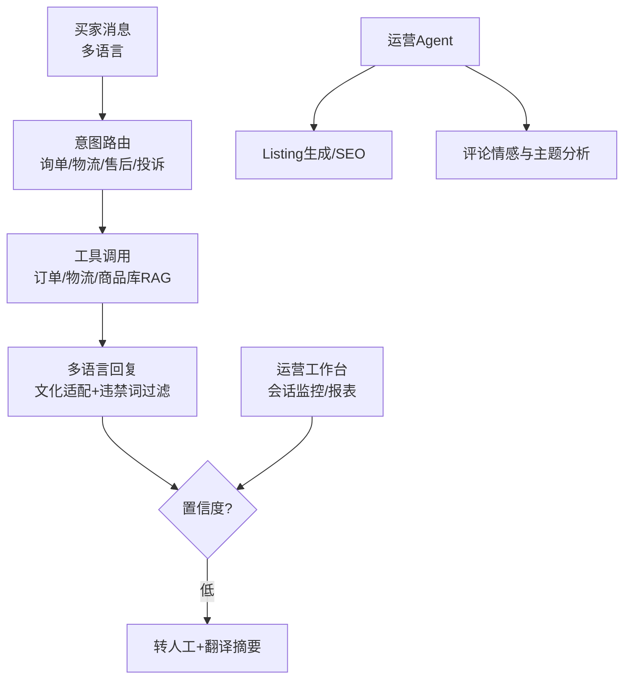

## 第一部分：选题填表

| **类别** | **编号** | **题目** | **限报** | **要求** | **需求概述** | **担任角色** | **建议方案** | **建议语言** | **成果形式** |
|:---:|:---:|:---|:---:|:---:|:---|:---|:---|:---:|:---|
| **2026年8月热点方向** | 48 | **跨境电商多语言智能客服与运营Agent** | 4 | | 跨境电商出海是2026年持续高景气赛道，AI客服与运营Agent是降本刚需。构建一个面向跨境电商的多语言智能客服与运营Agent平台：客服侧支持英/西/法/德/阿等多语言买家咨询，自动识别意图（询单、物流查询、退换货、投诉），结合商品库与订单系统（模拟）给出准确回答，低置信度转人工并附翻译摘要；运营侧Agent自动生成多语言商品Listing（标题/五点/描述/A+文案）、关键词SEO优化、竞品评论情感分析、广告词建议；内置跨文化合规词库（宗教/禁忌/平台违禁词过滤）与时区智能回复策略。 | 架构师，后端，算法，前端 | **客服Agent**：LangGraph意图路由 + 订单/物流工具调用（Function Calling）+ 翻译层（LLM多语言直通） **运营Agent**：Listing生成模板库（Amazon/Temu/TikTok Shop规范）+ 评论爬取与情感/主题聚类分析 **知识库**：商品库RAG（规格/政策/FAQ）+ 违禁词过滤（正则+LLM双通道） **工程**：FastAPI + PostgreSQL + Redis + React工作台（会话监控/人工接管/运营报表） | Python + TypeScript | 系统、开发报告和部署文档 |

## 第二部分：完整设计方案与开发思路（4周版）

### 一、选题背景与价值定位

国内跨境电商卖家数量持续增长，多语言客服成本高企，AI Agent可将客服人力降低50%以上；“AI运营”（Listing生成、评论分析）已成ERP厂商标配模块。本项目面向出海SaaS与电商运营岗位，训练多语言Agent、工具调用、内容生成三项复合能力。

### 二、系统架构设计

### 三、核心功能模块

1. **多语言客服Agent**：LLM原生多语言对话（≥5种语言），意图识别→工具调用（查订单状态、物流轨迹、退货政策）→生成回复；全程自动检测买家语言并同语言回复。
2. **转人工与摘要**：低置信度/投诉升级自动转人工，附中文摘要（买家诉求+已核查信息），支持客服双语对照界面。
3. **Listing生成Agent**：输入产品参数与目标站点，生成符合平台规范的标题/五点/描述，自动嵌入高流量关键词；支持A/B版本批量生成。
4. **评论分析**：爬取/导入竞品评论，情感极性+主题聚类（质量/物流/尺码等），输出改进建议与差评关键词告警。
5. **合规与时区策略**：违禁词库（平台规则+宗教文化禁忌）双通道过滤；按买家时区生成回复承诺时效；全部回复留痕可审计。

### 四、开发路线图（4周）

| 阶段 | 任务 | 输出物 |
|:---|:---|:---|
| 第1周 | 意图路由+商品库RAG+订单模拟系统 | 单语言客服闭环 |
| 第2周 | 多语言扩展+转人工工作台；违禁词过滤 | 多语言客服 |
| 第3周 | Listing生成+评论分析Agent | 运营侧能力 |
| 第4周 | 报表与审计；端到端演练（模拟店铺）；答辩 | 交付版v1.0 |

### 五、验证方案

- 客服：自建200条多语言咨询测试集，意图识别准确率≥90%，答案事实准确率≥95%（对照订单系统）。
- 合规：注入100条违禁场景，拦截率≥98%。
- Listing质量：生成文案经LLM评委+人工抽检，平台规范符合率≥95%。

### 六、成果形式

- 平台源代码（含中文注释）+ 模拟店铺数据包 + 部署文档
- 多语言客服评测报告与Listing样例集
